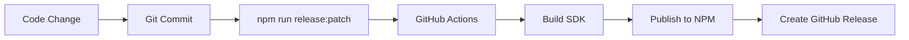

# 📦 NPM SDK Publishing Setup

This guide shows how to set up NPM publishing for your TypeScript SDK.

## Prerequisites

1. **NPM Account**: Create account at https://www.npmjs.com/
2. **Organization** (Optional): Create `@thunderfat` organization
3. **Access Token**: Generate publishing token

## Step 1: Create NPM Account & Organization

```bash
# Create account at npmjs.com
# Optional: Create organization @thunderfat
# This allows publishing @thunderfat/backend-sdk
```

## Step 2: Generate NPM Token

1. Login to NPM: https://www.npmjs.com/
2. Go to **Account Settings** → **Access Tokens**
3. Click **"Generate New Token"**
4. Select **"Automation"** (for CI/CD)
5. Copy the token (starts with `npm_`)

## Step 3: Add NPM Token to GitHub Secrets

```bash
# In GitHub repository settings → Secrets → Actions
# Add new secret:
Name: NPM_TOKEN
Value: npm_xxxxxxxxxxxxxxxxxxxxxxxxxxxxxxxx
```

## Step 4: Update SDK Package Configuration

The SDK is already configured with:

```json
{
  "name": "@thunderfat/backend-sdk",
  "version": "1.0.0",
  "description": "TypeScript SDK for ThunderFat Backend API",
  "main": "index.js",
  "types": "index.d.ts",
  "repository": {
    "type": "git",
    "url": "https://github.com/bolaxxx/thunderfat-spring-boot-back.git"
  },
  "keywords": ["thunderfat", "api", "sdk", "typescript"],
  "author": "ThunderFat Team",
  "license": "MIT"
}
```

## Step 5: Publishing Commands

### Manual Publishing (from sdk/ directory)
```bash
cd sdk
npm login
npm publish --access public
```

### Automated Publishing (via GitHub Actions)
```bash
# Trigger release with semantic versioning
npm run release:patch   # 1.0.0 → 1.0.1
npm run release:minor   # 1.0.0 → 1.1.0  
npm run release:major   # 1.0.0 → 2.0.0
```

## Step 6: Configure GitHub Actions NPM Publishing

The workflow is already configured to:

1. **Build SDK** from OpenAPI spec
2. **Run tests** to validate SDK
3. **Publish to NPM** with version from git tag
4. **Create GitHub release** with changelog

## Package Installation

Once published, users can install:

```bash
# Install the SDK
npm install @thunderfat/backend-sdk

# TypeScript usage
import { DefaultService } from '@thunderfat/backend-sdk';

const client = new DefaultService({
  BASE: 'https://api.thunderfat.com'
});

const alimentos = await client.getAlimentos();
```

## Publishing Workflow



## Verification

Check published package:
- **NPM**: https://www.npmjs.com/package/@thunderfat/backend-sdk
- **GitHub Releases**: https://github.com/bolaxxx/thunderfat-spring-boot-back/releases

---

**Next Step**: Deploy to production environment
