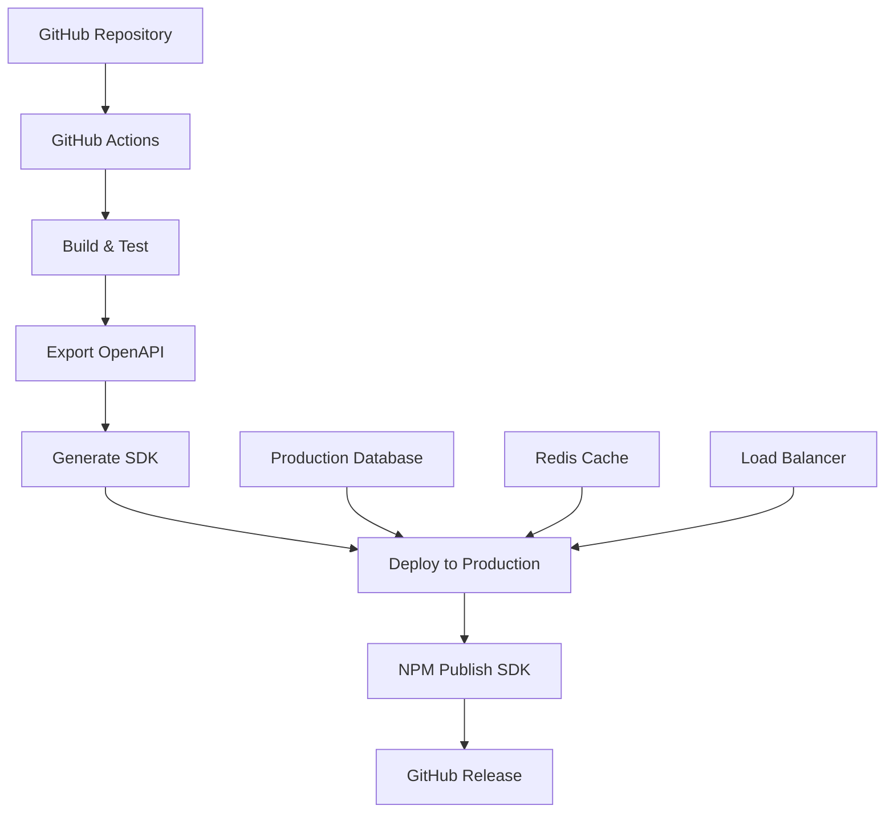

# 🚀 Production Deployment Guide

Complete guide for deploying ThunderFat Backend to production with the automated pipeline.

## Production Architecture



## Deployment Options

### Option 1: Railway (Recommended for MVP)

```bash
# 1. Install Railway CLI
npm install -g @railway/cli

# 2. Login and connect
railway login
railway link

# 3. Add production variables
railway variables set MYSQL_HOST=your-host
railway variables set MYSQL_USERNAME=your-user
railway variables set MYSQL_PASSWORD=your-pass
railway variables set MYSQL_DATABASE=thunderfatboot

# 4. Deploy
railway up
```

### Option 2: Heroku

```bash
# 1. Install Heroku CLI
# 2. Create app
heroku create thunderfat-backend

# 3. Add JawsDB MySQL addon
heroku addons:create jawsdb:kitefin

# 4. Configure environment
heroku config:set SPRING_PROFILES_ACTIVE=prod
heroku config:set SERVER_PORT=\${PORT}

# 5. Deploy
git push heroku master
```

### Option 3: AWS ECS (Enterprise)

```yaml
# docker-compose.yml for production
version: '3.8'
services:
  app:
    build: .
    ports:
      - "8080:8080"
    environment:
      - SPRING_PROFILES_ACTIVE=prod
      - MYSQL_HOST=\${MYSQL_HOST}
      - MYSQL_USERNAME=\${MYSQL_USERNAME}
      - MYSQL_PASSWORD=\${MYSQL_PASSWORD}
    depends_on:
      - mysql
      - redis
  
  mysql:
    image: mysql:8.0
    environment:
      MYSQL_ROOT_PASSWORD: \${MYSQL_ROOT_PASSWORD}
      MYSQL_DATABASE: thunderfatboot
    volumes:
      - mysql_data:/var/lib/mysql
  
  redis:
    image: redis:7-alpine
    command: redis-server --requirepass \${REDIS_PASSWORD}

volumes:
  mysql_data:
```

## Production Configuration

### 1. Application Properties (Production)

```properties
# src/main/resources/application-prod.properties
spring.profiles.active=prod
server.port=\${PORT:8080}

# Database
spring.datasource.url=jdbc:mysql://\${MYSQL_HOST:localhost}:\${MYSQL_PORT:3306}/\${MYSQL_DATABASE:thunderfatboot}?useSSL=true&requireSSL=true&verifyServerCertificate=true
spring.datasource.username=\${MYSQL_USERNAME}
spring.datasource.password=\${MYSQL_PASSWORD}
spring.datasource.driver-class-name=com.mysql.cj.jdbc.Driver

# JPA
spring.jpa.hibernate.ddl-auto=validate
spring.jpa.show-sql=false
spring.jpa.properties.hibernate.dialect=org.hibernate.dialect.MySQL8Dialect

# Redis Cache
spring.data.redis.host=\${REDIS_HOST:localhost}
spring.data.redis.port=\${REDIS_PORT:6379}
spring.data.redis.password=\${REDIS_PASSWORD:}

# Security
thunderfat.jwt.secret=\${JWT_SECRET}
thunderfat.jwt.expiration=\${JWT_EXPIRATION:86400000}

# OpenAPI
springdoc.api-docs.path=/v3/api-docs
springdoc.swagger-ui.path=/swagger-ui.html
```

### 2. Dockerfile for Production

```dockerfile
FROM openjdk:21-jre-slim

WORKDIR /app

COPY target/thunderfat-spring-boot-backend-*.jar app.jar

EXPOSE 8080

HEALTHCHECK --interval=30s --timeout=3s --start-period=5s --retries=3 \
  CMD curl -f http://localhost:8080/actuator/health || exit 1

CMD ["java", "-jar", "app.jar"]
```

## Environment Variables

### Required for Production

```bash
# Database
MYSQL_HOST=your-production-mysql-host.com
MYSQL_PORT=3306
MYSQL_DATABASE=thunderfatboot
MYSQL_USERNAME=thunderfat_user
MYSQL_PASSWORD=secure-password-here

# Redis (Optional but recommended)
REDIS_HOST=your-redis-host.com
REDIS_PORT=6379
REDIS_PASSWORD=redis-password

# Security
JWT_SECRET=your-256-bit-secret-key-here
JWT_EXPIRATION=86400000

# Spring Profile
SPRING_PROFILES_ACTIVE=prod

# Port (for platforms like Heroku)
PORT=8080
```

## Monitoring & Health Checks

### Health Endpoints
- **Health**: `/actuator/health`
- **Info**: `/actuator/info`
- **Metrics**: `/actuator/metrics`
- **API Docs**: `/v3/api-docs`

### Production Monitoring

```bash
# Check application health
curl https://your-app.com/actuator/health

# Expected response:
{
  "status": "UP",
  "components": {
    "db": {"status": "UP"},
    "redis": {"status": "UP"},
    "diskSpace": {"status": "UP"}
  }
}
```

## SSL/TLS Configuration

### Option 1: Platform SSL (Recommended)
- Railway: Automatic SSL
- Heroku: Automatic SSL
- Vercel: Automatic SSL

### Option 2: Custom SSL Certificate

```properties
# application-prod.properties
server.ssl.enabled=true
server.ssl.key-store=classpath:keystore.p12
server.ssl.key-store-password=\${SSL_KEYSTORE_PASSWORD}
server.ssl.key-store-type=PKCS12
server.ssl.key-alias=thunderfat
```

## Database Migration

### Production Database Setup

```sql
-- Create production database
CREATE DATABASE thunderfatboot CHARACTER SET utf8mb4 COLLATE utf8mb4_unicode_ci;

-- Create user with limited privileges
CREATE USER 'thunderfat_user'@'%' IDENTIFIED BY 'secure-password-here';
GRANT SELECT, INSERT, UPDATE, DELETE ON thunderfatboot.* TO 'thunderfat_user'@'%';
FLUSH PRIVILEGES;
```

## Deployment Checklist

### Pre-Deployment
- [ ] All tests passing
- [ ] Environment variables configured
- [ ] Database migrations ready
- [ ] SSL certificates configured
- [ ] Monitoring setup
- [ ] Backup strategy in place

### Deployment
- [ ] Build application (`./mvnw clean package`)
- [ ] Export OpenAPI spec
- [ ] Generate SDK
- [ ] Deploy to platform
- [ ] Verify health endpoints
- [ ] Test critical API endpoints

### Post-Deployment
- [ ] Monitor application logs
- [ ] Verify database connections
- [ ] Test SDK functionality
- [ ] Update documentation
- [ ] Notify stakeholders

## Testing Production Deployment

```bash
# 1. Health check
curl https://your-app.com/actuator/health

# 2. API documentation
curl https://your-app.com/v3/api-docs

# 3. Authentication endpoint
curl -X POST https://your-app.com/api/auth/login \
  -H "Content-Type: application/json" \
  -d '{"username":"test","password":"test"}'

# 4. Protected endpoint (with token)
curl https://your-app.com/api/alimentos \
  -H "Authorization: Bearer YOUR_JWT_TOKEN"
```

## Rollback Strategy

```bash
# Railway rollback
railway rollback

# Heroku rollback
heroku rollback v123

# Manual rollback
git revert HEAD
git push origin master
```

## Performance Optimization

### JVM Settings for Production

```bash
# Recommended JVM flags
JAVA_OPTS="-Xms512m -Xmx1024m -XX:+UseG1GC -XX:+HeapDumpOnOutOfMemoryError"
```

### Database Connection Pooling

```properties
# HikariCP settings for production
spring.datasource.hikari.maximum-pool-size=20
spring.datasource.hikari.minimum-idle=5
spring.datasource.hikari.idle-timeout=300000
spring.datasource.hikari.connection-timeout=20000
```

## Security Hardening

```properties
# Production security settings
server.error.include-message=never
server.error.include-binding-errors=never
server.error.include-stacktrace=never
server.error.include-exception=false

# CORS for production
thunderfat.cors.allowed-origins=https://your-frontend.com
thunderfat.cors.allowed-methods=GET,POST,PUT,DELETE,OPTIONS
```

---

## 🎉 Deployment Complete!

Your ThunderFat Backend is now deployed with:
- ✅ Automated API contract management
- ✅ TypeScript SDK publishing
- ✅ Health monitoring
- ✅ Production security
- ✅ Scalable architecture

**Production URL**: `https://your-app.com`  
**API Documentation**: `https://your-app.com/swagger-ui.html`  
**Health Check**: `https://your-app.com/actuator/health`
